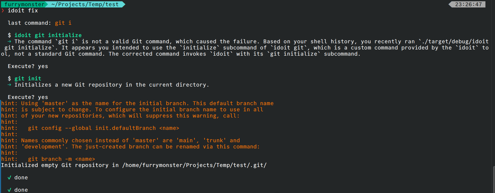

# idoit



Turn plain English into shell commands. AI suggests a command; you confirm before it runs.

## Quick start

```bash
cargo install --path .
idoit setup
idoit list files in the current directory
```

Run `idoit --help` for flags. Common ones: `--fix`, `--explain`, `--refine`, `--last`, `--tui`, `--macro <name> …` (use `@name` in prompts; stored in `macros.toml`).

## Config

- `~/.config/idoit/config.toml`
- Keys: `OPENAI_API_KEY`, `ANTHROPIC_API_KEY`, `GEMINI_API_KEY`, or use Ollama locally.

## Data (local)

- `~/.local/share/idoit/history.json` — idoit-only log for `--last` / `--refine`
- `~/.local/share/idoit/terminal_context.jsonl` — recent non-idoit commands (filled by `idoit init` hooks)

## Shell helpers

```bash
eval "$(idoit init bash)"   # or zsh / fish
```
