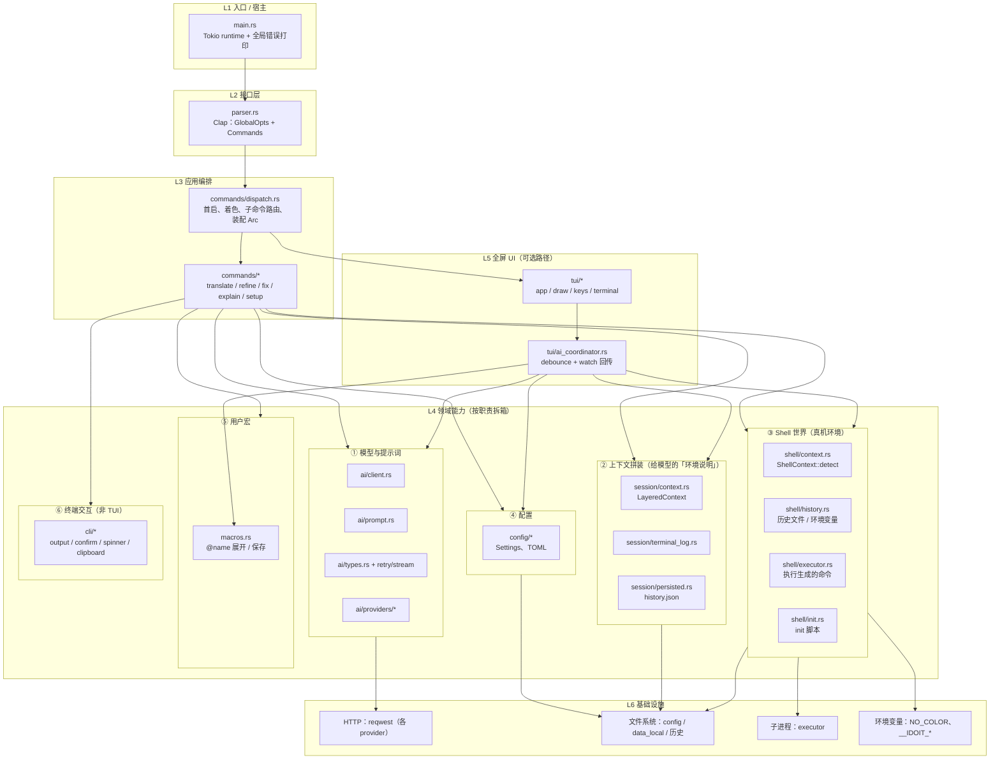

```mermaid
flowchart TB
    subgraph L1["L1 入口 / 宿主"]
        main["main.rs\nTokio runtime + 全局错误打印"]
    end

    subgraph L2["L2 接口层"]
        parser["parser.rs\nClap：GlobalOpts + Commands"]
    end

    subgraph L3["L3 应用编排"]
        dispatch["commands/dispatch.rs\n首启、着色、子命令路由、装配 Arc"]
        handlers["commands/*\ntranslate / refine / fix / explain / setup"]
    end

    subgraph L4["L4 领域能力（按职责拆箱）"]
        direction TB
        subgraph C_AI["① 模型与提示词"]
            aic["ai/client.rs"]
            aip["ai/prompt.rs"]
            aity["ai/types.rs + retry/stream"]
            prov["ai/providers/*"]
        end
        subgraph C_CTX["② 上下文拼装（给模型的「环境说明」）"]
            lay["session/context.rs\nLayeredContext"]
            term["session/terminal_log.rs"]
            pers["session/persisted.rs\nhistory.json"]
        end
        subgraph C_SH["③ Shell 世界（真机环境）"]
            sctx["shell/context.rs\nShellContext::detect"]
            shist["shell/history.rs\n历史文件 / 环境变量"]
            sexec["shell/executor.rs\n执行生成的命令"]
            sinit["shell/init.rs\ninit 脚本"]
        end
        subgraph C_CFG["④ 配置"]
            cfg["config/*\nSettings、TOML"]
        end
        subgraph C_MACRO["⑤ 用户宏"]
            mac["macros.rs\n@name 展开 / 保存"]
        end
        subgraph C_CLI["⑥ 终端交互（非 TUI）"]
            climod["cli/*\noutput / confirm / spinner / clipboard"]
        end
    end

    subgraph L5["L5 全屏 UI（可选路径）"]
        tuiroot["tui/*\napp / draw / keys / terminal"]
        coord["tui/ai_coordinator.rs\ndebounce + watch 回传"]
    end

    subgraph L6["L6 基础设施"]
        http["HTTP：reqwest（各 provider）"]
        fs["文件系统：config / data_local / 历史"]
        sub["子进程：executor"]
        env["环境变量：NO_COLOR、__IDOIT_*"]
    end

    main --> parser
    parser --> dispatch
    dispatch --> handlers
    dispatch --> tuiroot
    handlers --> C_AI
    handlers --> C_CTX
    handlers --> C_SH
    handlers --> C_CFG
    handlers --> C_MACRO
    handlers --> C_CLI
    tuiroot --> coord
    coord --> C_AI
    coord --> C_CTX
    coord --> C_SH
    coord --> C_CFG
    coord --> mac
    C_AI --> http
    C_CFG --> fs
    C_CTX --> fs
    C_SH --> fs
    C_SH --> sub
    C_SH --> env

```